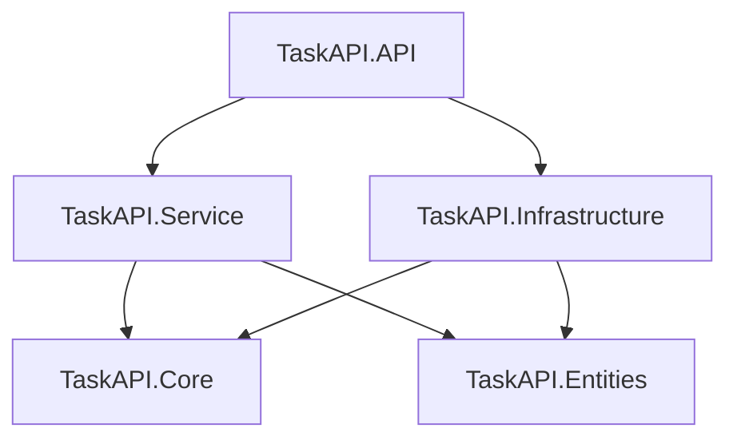
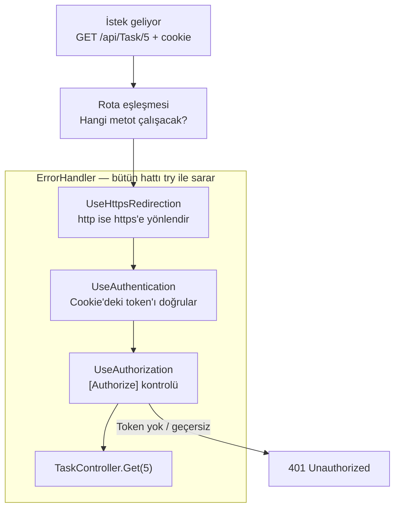
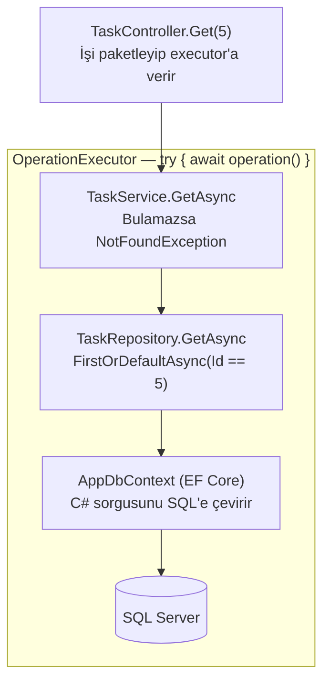
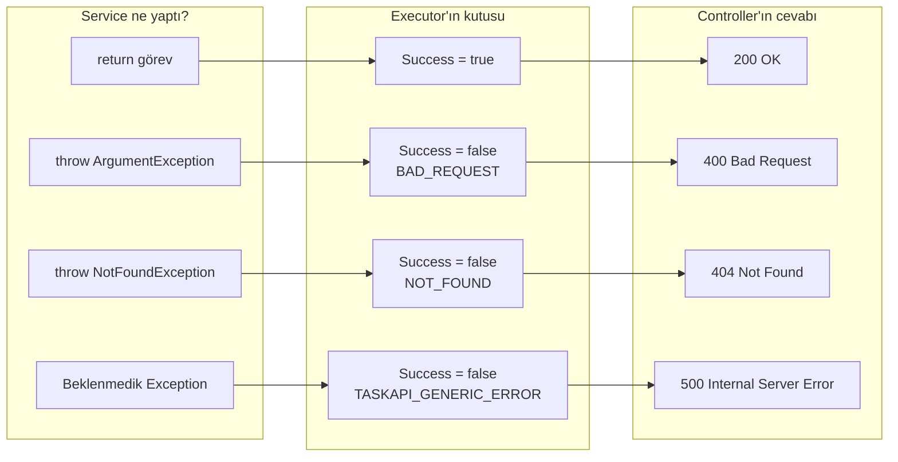
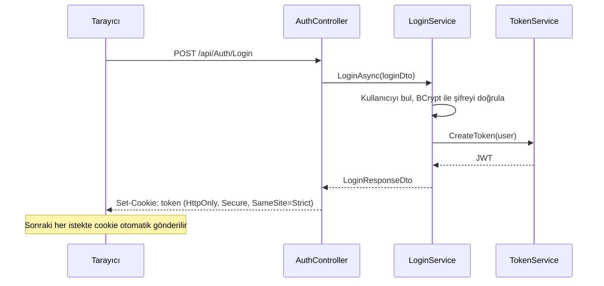

# TaskAPI

Görev (task) yönetimi için yazılmış, katmanlı mimariye sahip bir ASP.NET Core Web API projesi.
Kullanıcılar kayıt olup giriş yapabilir, giriş yaptıktan sonra görev ekleyip listeleyebilir, güncelleyebilir ve silebilir.

> Bu proje öğrenme amacıyla adım adım geliştirilmektedir.

## Kullanılan teknolojiler

- **.NET 10** / ASP.NET Core Web API
- **Entity Framework Core** + **SQL Server (LocalDB)**
- **JWT** ile kimlik doğrulama (token, HttpOnly cookie içinde taşınır)
- **BCrypt** ile şifre hash'leme
- **OpenAPI** + **Scalar** ile API dokümantasyonu

## Proje yapısı

| Proje | Görevi |
|---|---|
| `TaskAPI.API` | Controller'lar, `Program.cs`, ayarlar. İsteklerin giriş kapısı |
| `TaskAPI.Service` | İş kuralları (`TaskService`, `LoginService`, `TokenService`) |
| `TaskAPI.Infrastructure` | Veritabanı erişimi (`AppDbContext`, repository'ler, migration'lar) |
| `TaskAPI.Entities` | Entity'ler, DTO'lar, enum'lar ve interface'ler |
| `TaskAPI.Core` | Ortak araçlar: `OperationExecutor`, `ErrorHandler`, `ResponseModel`, hata kodları |



## Endpoint'ler

| Metot | Adres | Açıklama | Giriş gerekli mi? |
|---|---|---|---|
| `POST` | `/api/Auth/Register` | Yeni kullanıcı oluşturur | Hayır |
| `POST` | `/api/Auth/Login` | Giriş yapar, token'ı cookie'ye yazar | Hayır |
| `GET` | `/api/Task` | Tüm görevleri listeler | Evet |
| `GET` | `/api/Task/{id}` | Tek bir görevi getirir | Evet |
| `POST` | `/api/Task` | Yeni görev ekler | Evet |
| `PUT` | `/api/Task/{id}` | Görevi günceller | Evet |
| `DELETE` | `/api/Task/{id}` | Görevi siler | Evet |

## Cevap formatı

Bütün cevaplar aynı kutu (`ResponseModel`) içinde döner:

**Başarılı:**
```json
{
  "success": true,
  "result": { "id": 5, "title": "Rapor yaz", "...": "..." },
  "error": null
}
```

**Hatalı:**
```json
{
  "success": false,
  "result": null,
  "error": {
    "errorCode": "NOT_FOUND",
    "message": "Task Not Found",
    "correlationId": "…",
    "timeStamp": "…"
  }
}
```

### Hata kodları

| Kod | Anlamı | HTTP status |
|---|---|---|
| `BAD_REQUEST` | Gönderilen veri kurallara uymuyor | 400 |
| `UNAUTHORIZED` | Giriş yapılmamış / token geçersiz | 401 |
| `INVALID_PASSWORD` | Şifre yanlış | 401 |
| `NOT_FOUND` | İstenen kayıt bulunamadı | 404 |
| `CONFLICT` | Kayıt zaten var (ör. kullanıcı adı alınmış) | 409 |
| `TASKAPI_GENERIC_ERROR` | Beklenmedik hata (executor yakaladı) | 500 |
| `INTERNAL_SERVER_ERROR` | Beklenmedik hata (ErrorHandler yakaladı) | 500 |

## Bir isteğin yolculuğu

Örnek: Kullanıcı giriş yapmış, tarayıcıda `token` cookie'si var ve `GET /api/Task/5` isteği gönderiliyor.

### 1. Kapıdan Controller'a kadar



- **Rota eşleşmesi:** .NET, adrese bakıp hangi Controller metodunun çalışacağını bulur (`MapControllers`).
- **ErrorHandler:** Kendisi iş yapmaz, isteği `await next(context)` ile içeri geçirir. İçeride yakalanmamış bir hata olursa standart bir hata cevabı yazar. Son güvenlik ağıdır.
- **UseAuthentication:** `OnMessageReceived` ile token'ı cookie'den alır. İmzayı, issuer'ı, audience'ı ve süreyi doğrular, kullanıcıyı `HttpContext.User`'a koyar.
- **UseAuthorization:** `[Authorize]` olan bir metoda giriş yapılmadan gelinirse 401 döner, Controller hiç çalışmaz.
- **DI Container:** Controller'ı ve ihtiyaç duyduğu `TaskService` → `TaskRepository` → `AppDbContext` zincirini oluşturur.

### 2. Controller'dan veritabanına



- Controller, Service çağrısını **çalıştırmadan** bir paket (`Func<Task<T>>`) olarak executor'a verir.
- Executor log'a "started" yazar ve paketi **kendi `try` bloğunun içinde** çalıştırır. Aşağıda bir hata olursa ilk yakalayan executor olur.
- EF Core, veritabanından gelen satırı `Task` entity'sine çevirir. Service de bunu `TaskDto`'ya çevirip döndürür.

### 3. Sonuçtan status koduna



- **Executor**, gelen hatanın türüne göre `ResponseModel`'e uygun hata kodunu yazar. Beklenmedik hatalarda gerçek sebebi log'a yazar, kullanıcıya genel bir mesaj döner.
- **Controller**, `Success == false` ise hata koduna bakıp (`switch`) status kodunu seçer. Başarılıysa `Ok` döner.
- Cevap JSON'a çevrilir ve middleware'lerden geriye doğru geçerek istemciye ulaşır.

### Giriş (login) ve cookie



- Token'ın içinde yalnızca kullanıcı id'si ve kullanıcı adı bulunur. Şifre gibi gizli bilgiler token'a konmaz.
- Cookie **HttpOnly** olduğu için sayfadaki JavaScript token'ı okuyamaz. Token cevabın gövdesinde gönderilmez.
