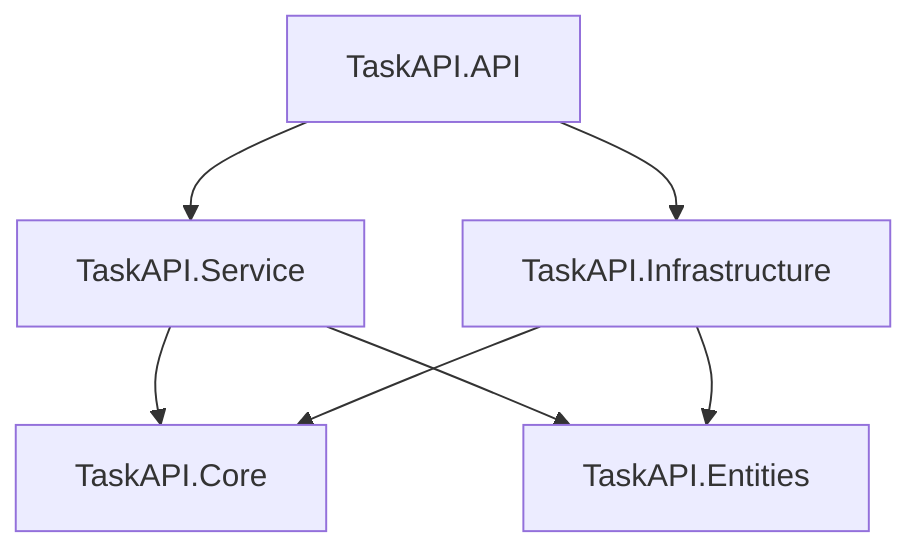
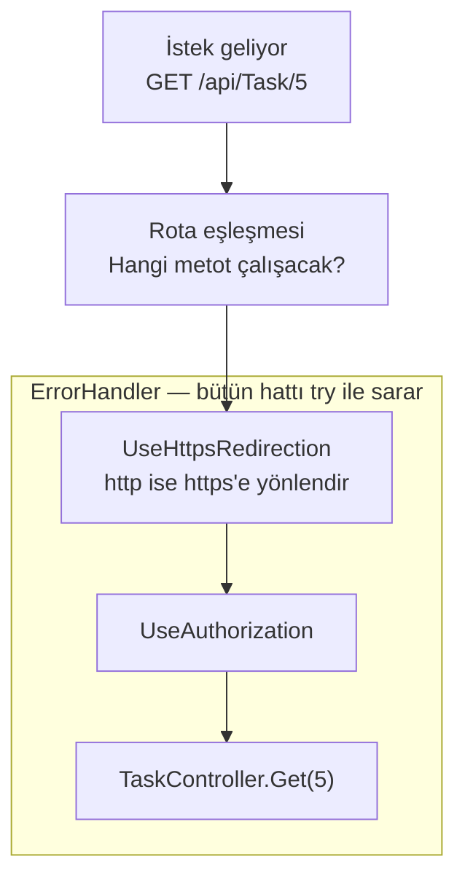
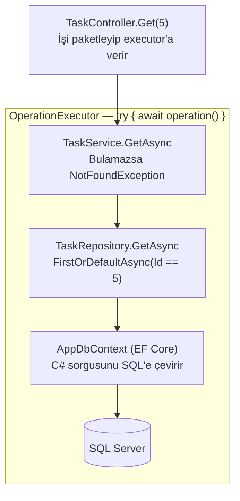
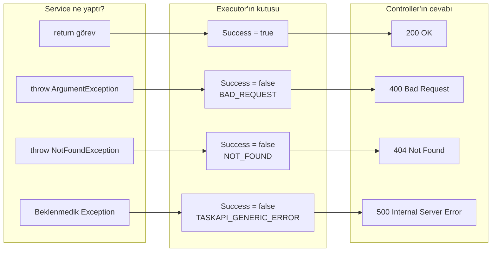
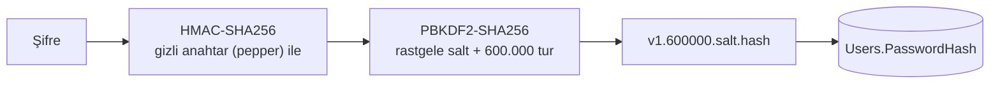
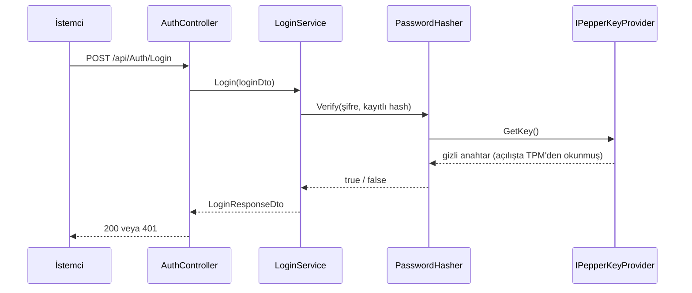

# TaskAPI

Görev (task) yönetimi için yazılmış, katmanlı mimariye sahip bir ASP.NET Core Web API projesi.
Kullanıcılar kayıt olup giriş yapabilir; görevler eklenebilir, listelenebilir, güncellenebilir ve silinebilir.

> Bu proje öğrenme amacıyla adım adım geliştirilmektedir.

## Kullanılan teknolojiler

- **.NET 10** / ASP.NET Core Web API
- **Entity Framework Core** + **SQL Server (LocalDB)**
- **PBKDF2-HMAC-SHA256** + **HMAC pepper** ile kendi yazılmış şifre hash'leme sistemi
- **TPM 2.0** (`Microsoft.TSS`) ile donanıma mühürlenmiş gizli anahtar
- **OpenAPI** + **Scalar** ile API dokümantasyonu

## Proje yapısı

| Proje | Görevi |
|---|---|
| `TaskAPI.API` | Controller'lar, `Program.cs`, ayarlar. İsteklerin giriş kapısı |
| `TaskAPI.Service` | İş kuralları (`TaskService`, `LoginService`) |
| `TaskAPI.Infrastructure` | Dış dünyayla konuşan kısımlar: veritabanı (`AppDbContext`, repository'ler, migration'lar) ve güvenlik (`Security/`: `PasswordHasher`, key sağlayıcıları) |
| `TaskAPI.Entities` | Entity'ler, DTO'lar, enum'lar ve interface'ler |
| `TaskAPI.Core` | Ortak araçlar: `OperationExecutor`, `ErrorHandler`, `ResponseModel`, hata kodları |
| `TaskAPI.TpmLab` | TPM denemeleri ve gizli anahtarın ilk kez üretilip mühürlenmesi için konsol uygulaması |


```mermaid
flowchart TD
    API[TaskAPI.API] --> Service[TaskAPI.Service]
    API --> Infrastructure[TaskAPI.Infrastructure]
    Service --> Core[TaskAPI.Core]
    Service --> Entities[TaskAPI.Entities]
    Infrastructure --> Core
    Infrastructure --> Entities
```

## Endpoint'ler

| Metot | Adres | Açıklama |
|---|---|---|
| `POST` | `/api/Auth/Register` | Yeni kullanıcı oluşturur |
| `POST` | `/api/Auth/Login` | Kullanıcı adı ve şifreyi doğrular |
| `GET` | `/api/Task` | Tüm görevleri listeler |
| `GET` | `/api/Task/{id}` | Tek bir görevi getirir |
| `POST` | `/api/Task` | Yeni görev ekler |
| `PUT` | `/api/Task/{id}` | Görevi günceller |
| `DELETE` | `/api/Task/{id}` | Görevi siler |

> Şu an token tabanlı kimlik doğrulama yok; görev endpoint'leri herkese açık. Login yalnızca kullanıcı adı ve şifrenin doğru olup olmadığını söyler. Bu, bilinçli bir karardır; kimlik doğrulama ileriki bir aşamada eklenecek.

## Cevap formatı

Bütün cevaplar aynı kutu (`ResponseModel`) içinde döner:

**Başarılı:**
```json
{
  "success": true,
  "result": { "id": 5, "title": "Rapor yaz", "...": "..." },
  "error": null
}
```

**Hatalı:**
```json
{
  "success": false,
  "result": null,
  "error": {
    "errorCode": "NOT_FOUND",
    "message": "Task Not Found",
    "correlationId": "…",
    "timeStamp": "…"
  }
}
```

### Hata kodları

| Kod | Anlamı | HTTP status |
|---|---|---|
| `BAD_REQUEST` | Gönderilen veri kurallara uymuyor | 400 |
| `UNAUTHORIZED` | Kullanıcı adı veya şifre hatalı | 401 |
| `NOT_FOUND` | İstenen kayıt bulunamadı | 404 |
| `CONFLICT` | Kayıt zaten var (ör. kullanıcı adı alınmış) | 409 |
| `TASKAPI_GENERIC_ERROR` | Beklenmedik hata (executor yakaladı) | 500 |
| `INTERNAL_SERVER_ERROR` | Beklenmedik hata (ErrorHandler yakaladı) | 500 |

## Bir isteğin yolculuğu

Örnek: `GET /api/Task/5` isteği gönderiliyor.

### 1. Kapıdan Controller'a kadar


```mermaid
flowchart TD
    A["İstek geliyor<br/>GET /api/Task/5"] --> B["Rota eşleşmesi<br/>Hangi metot çalışacak?"]
    B --> C
    subgraph EH["ErrorHandler — bütün hattı try ile sarar"]
        C["UseHttpsRedirection<br/>http ise https'e yönlendir"] --> D["UseAuthorization"]
        D --> F["TaskController.Get(5)"]
    end
```

- **Rota eşleşmesi:** .NET, adrese bakıp hangi Controller metodunun çalışacağını bulur (`MapControllers`).
- **ErrorHandler:** Kendisi iş yapmaz, isteği `await next(context)` ile içeri geçirir. İçeride yakalanmamış bir hata olursa standart bir hata cevabı yazar. Son güvenlik ağıdır.
- **UseAuthorization:** Şu an hiçbir endpoint'te `[Authorize]` olmadığı için bir şey yapmaz; kimlik doğrulama eklendiğinde devreye girecek.
- **DI Container:** Controller'ı ve ihtiyaç duyduğu `TaskService` → `TaskRepository` → `AppDbContext` zincirini oluşturur.

### 2. Controller'dan veritabanına


```mermaid
flowchart TD
    A["TaskController.Get(5)<br/>İşi paketleyip executor'a verir"] --> S
    subgraph EX["OperationExecutor — try { await operation() }"]
        S["TaskService.GetAsync<br/>Bulamazsa NotFoundException"] --> R["TaskRepository.GetAsync<br/>FirstOrDefaultAsync(Id == 5)"]
        R --> E["AppDbContext (EF Core)<br/>C# sorgusunu SQL'e çevirir"]
        E --> Q[("SQL Server")]
    end
```

- Controller, Service çağrısını **çalıştırmadan** bir paket (`Func<Task<T>>`) olarak executor'a verir.
- Executor log'a "started" yazar ve paketi **kendi `try` bloğunun içinde** çalıştırır. Aşağıda bir hata olursa ilk yakalayan executor olur.
- EF Core, veritabanından gelen satırı `Task` entity'sine çevirir. Service de bunu `TaskDto`'ya çevirip döndürür.

### 3. Sonuçtan status koduna


```mermaid
flowchart LR
    subgraph S["Service ne yaptı?"]
        S1["return görev"]
        S2["throw ArgumentException"]
        S3["throw NotFoundException"]
        S4["Beklenmedik Exception"]
    end
    subgraph X["Executor'ın kutusu"]
        X1["Success = true"]
        X2["Success = false<br/>BAD_REQUEST"]
        X3["Success = false<br/>NOT_FOUND"]
        X4["Success = false<br/>TASKAPI_GENERIC_ERROR"]
    end
    subgraph C["Controller'ın cevabı"]
        C1["200 OK"]
        C2["400 Bad Request"]
        C3["404 Not Found"]
        C4["500 Internal Server Error"]
    end
    S1 --> X1 --> C1
    S2 --> X2 --> C2
    S3 --> X3 --> C3
    S4 --> X4 --> C4
```

- **Executor**, gelen hatanın türüne göre `ResponseModel`'e uygun hata kodunu yazar. Beklenmedik hatalarda gerçek sebebi log'a yazar, kullanıcıya genel bir mesaj döner.
- **Controller**, `Success == false` ise hata koduna bakıp (`switch`) status kodunu seçer. Başarılıysa `Ok` döner.
- Cevap JSON'a çevrilir ve middleware'lerden geriye doğru geçerek istemciye ulaşır.

## Şifre güvenliği

Şifreler hazır bir kütüphane yerine, kanıtlanmış yapı taşlarıyla (HMAC, PBKDF2, güvenli rastgele sayı üreteci) kurulan kendi `PasswordHasher` sınıfıyla hash'lenir.

### Tasarım fikri

Sistemin fikri çift yarık deneyinden ilham alır: deneyin sonucu, **ölçüm cihazına** bağlıdır. Burada ölçüm cihazı, yalnızca sunucuda bulunan gizli bir anahtardır (**pepper**). Veritabanı sızsa bile, bu anahtara sahip olmayan biri için bütün doğrulama denemeleri rastgele ve anlamsız sonuçlar üretir; doğru şifreyi tahmin etse bile bunu fark edemez.

> Bu, kuantum fiziğini kullanan bir şifreleme değil; deneyden **ilham alan** bir tasarım modelidir. Güvenlik; HMAC, PBKDF2, salt ve anahtarın gizli tutulmasından gelir.

### Kayıt (Register) sırasında


```mermaid
flowchart LR
    P["Şifre"] --> H["HMAC-SHA256<br/>gizli anahtar (pepper) ile"]
    H --> K["PBKDF2-SHA256<br/>rastgele salt + 600.000 tur"]
    K --> F["v1.600000.salt.hash"]
    F --> DB[("Users.PasswordHash")]
```

### Saklama formatı

```
v1.600000.Nf3kL9vQz8xY2mP4rT6uWe==.8hJ1cK5bD7fG0aS3dF6gH9jK2lM4nO5pQ7rS=
│  │      │                        │
│  │      └ salt (16 byte, Base64) └ hash (32 byte, Base64)
│  └ tur sayısı
└ format sürümü
```

- **Sürüm:** Tarif ileride değişirse (`v2`), eski kayıtlar kendi tarifleriyle doğrulanmaya devam eder.
- **Tur sayısı:** Tur sayısı artırıldığında eski kullanıcılar kendi tur sayılarıyla doğrulanır.
- **Gizli anahtar veritabanında saklanmaz.**

### Giriş (Login) sırasında

Hash geri çevrilmez. Girilen şifre, kayıttan okunan salt ve tur sayısıyla **aynı tariften** geçirilir ve sonuç kayıtlı hash ile karşılaştırılır.


```mermaid
sequenceDiagram
    participant T as İstemci
    participant A as AuthController
    participant L as LoginService
    participant H as PasswordHasher
    participant K as IPepperKeyProvider
    T->>A: POST /api/Auth/Login
    A->>L: Login(loginDto)
    L->>H: Verify(şifre, kayıtlı hash)
    H->>K: GetKey()
    K-->>H: gizli anahtar (açılışta TPM'den okunmuş)
    H-->>L: true / false
    L-->>A: LoginResponseDto
    A-->>T: 200 veya 401
```

### Alınan önlemler

| Önlem | Neye karşı? |
|---|---|
| Her kullanıcıya rastgele **salt** (`RandomNumberGenerator`) | Hazır hash tabloları (rainbow table), aynı şifrelerin fark edilmesi |
| **PBKDF2**, 600.000 tur | Tahmin saldırılarını (brute force, sözlük saldırısı) yavaşlatmak |
| **HMAC pepper** (gizli anahtar) | Veritabanı tek başına sızdığında hash'lerin işe yaramaması |
| `CryptographicOperations.FixedTimeEquals` | Karşılaştırma süresinden bilgi sızması (timing attack) |
| Kullanıcı yok / şifre yanlış → **aynı 401 cevabı** | Kullanıcı adlarının keşfedilmesi (user enumeration) |
| Kullanıcı yoksa da **sahte bir doğrulama** çalıştırmak | Cevap süresinden kullanıcı adlarının keşfedilmesi |
| Başarılı olmayan her sonucu reddetmek (**fail closed**) | Eksik bir kontrolün girişe izin vermesi |
| Anahtar yoksa uygulamanın **açılmaması** | Sistemin sessizce anahtarsız ya da yanlış anahtarla çalışması |

## Gizli anahtar yönetimi (TPM)

Gizli anahtar diskte düz metin olarak durmaz. Bilgisayarın **TPM 2.0** güvenlik çipi tarafından **mühürlenmiş (sealed)** bir paket olarak saklanır:

```
C:\Users\<kullanıcı>\AppData\Roaming\TaskAPI\pepper.pub
C:\Users\<kullanıcı>\AppData\Roaming\TaskAPI\pepper.priv
```

- Paket, TPM'in içinden hiç çıkmayan bir tohumdan (seed) türetilen **ana kilit** ile şifrelenmiştir.
- Dosyalar kopyalanabilir, ancak **yalnızca bu çipte açılabilir.** Başka bir bilgisayarın TPM'i paketi reddeder.
- Uygulama açılırken `TpmPepperKeyProvider` ana kilidi aynı tariften yeniden üretir, paketi açar ve anahtarı **bir kez** belleğe alır (Singleton). Sonraki isteklerde TPM'e gidilmez.

Anahtarın nereden geldiği `IPepperKeyProvider` sözleşmesinin arkasına saklanmıştır:

| Sınıf | Anahtarın kaynağı | Durum |
|---|---|---|
| `TpmPepperKeyProvider` | TPM ile mühürlenmiş paket | Kullanımda |
| `ConfigurationPepperKeyProvider` | Uygulama ayarları (User Secrets / ortam değişkeni) | Yedek, DI'ye kayıtlı değil |

Anahtarın kaynağını değiştirmek için `Program.cs`'teki tek bir DI satırını değiştirmek yeterlidir; `PasswordHasher`, `LoginService` ve Controller'lar değişmez.

## Kurulum ve çalıştırma

### Gereksinimler

- **Windows** ve **TPM 2.0** (Windows'ta `tpm.msc` ile kontrol edilebilir)
- .NET 10 SDK
- SQL Server LocalDB (Visual Studio ile birlikte gelir)
- EF Core CLI aracı: `dotnet tool install --global dotnet-ef`

### Adımlar

1. Veritabanını oluştur:
   ```bash
   dotnet ef database update --project TaskAPI.Infrastructure --startup-project TaskAPI.API
   ```
2. Gizli anahtarı üret ve TPM ile mühürle (**her bilgisayarda bir kez**):
   ```bash
   dotnet run --project TaskAPI.TpmLab
   ```
   İlk çalıştırmada anahtar üretilip mühürlenir. Sonraki çalıştırmalar mevcut anahtarın üzerine yazmaz, yalnızca mühürün açılabildiğini kontrol eder.
3. Uygulamayı çalıştır:
   ```bash
   dotnet run --project TaskAPI.API --launch-profile https
   ```
4. API dokümantasyonunu aç: `https://localhost:7219/scalar`

## Kabul edilen riskler

- **Anahtar tek bir makinenin TPM'ine bağlıdır.** Anakart değişirse ya da TPM sıfırlanırsa (bazı BIOS güncellemeleri bunu yapabilir) mühür açılamaz ve kayıtlı bütün şifreler geçersiz olur; kullanıcıların yeniden kayıt olması gerekir.
- **Proje yalnızca Windows'ta çalışır.** TPM'e Windows'un TBS servisi (`TbsDevice`) üzerinden bağlanılır.
- **Konteyner / çok sunuculu yapıya uygun değildir.** Konteyner ya da birden fazla sunucu kullanılacaksa, anahtar yönetimi merkezi bir kasaya (Azure Key Vault, AWS KMS, HSM gibi) taşınmalıdır. Bunun için `IPepperKeyProvider` sözleşmesinin yeni bir uygulaması yazmak yeterlidir.
- **Uygulama çalışırken anahtar bellektedir.** Sunucunun kendisini ele geçiren biri bellekten anahtara ulaşabilir. Bu durumda bile salt ve 600.000 turluk PBKDF2, her şifre tahminini pahalı hâle getirmeye devam eder.
- **Şifre kuralları henüz yok.** Minimum/maksimum uzunluk ve zayıf şifre kontrolü ileride eklenecek.
